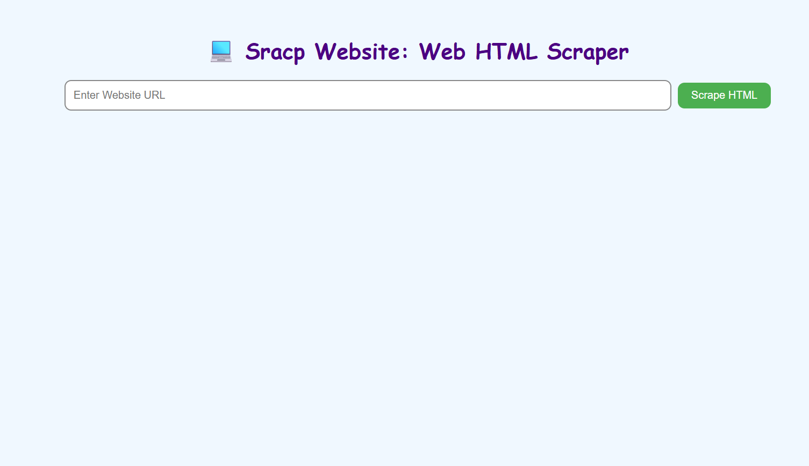
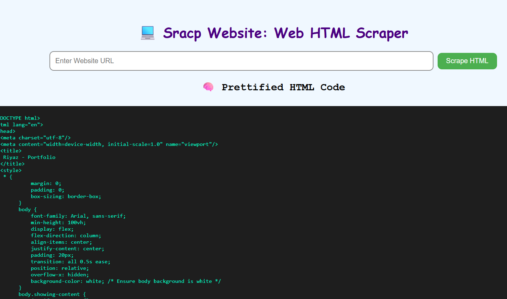

# 🌐 HTML Viewer - Simple Web Scraper 🧠

## 📌 About the Project

This is a simple and useful Python Flask app that allows users to:
- ✨ Enter a website URL
- 📄 View the full **HTML code**
- 📋 Copy the HTML code with one click

It uses `requests` and `BeautifulSoup` to fetch and prettify the website's HTML.  
No CSS or JavaScript scraping — just clean, organized HTML.

---

## 🚀 How to Use

1. Run the Python file (`app.py`)
2. Open `http://localhost:5000` in your browser
3. Enter any valid website URL (e.g., `https://example.com`)
4. Get and copy the full HTML code

---

## 🎯 Why Use This?

- Great for **students**, **beginners**, and **developers**
- Helps you **learn how websites are structured**
- Useful for **copying raw HTML templates**

---

## 🛠️ Technologies Used

- 🐍 Python
- 🌸 Flask
- 🔍 BeautifulSoup
- 💻 HTML, CSS, JavaScript (in one file)

---

## 📦 One File Code (Structure)

- `app.py` → Backend (Flask + Scraper)
- `index.html` → Frontend (form + result display + copy button)
- `preview.png` → Screenshot of the app UI

---

## 📸 Preview

> Save this image in the same folder as `preview.png`

---

## 📜 License

Free to use and modify for educational or personal projects.

> 🔧 Created with ❤️ using Python & Flask – Enjoy Scraping!
